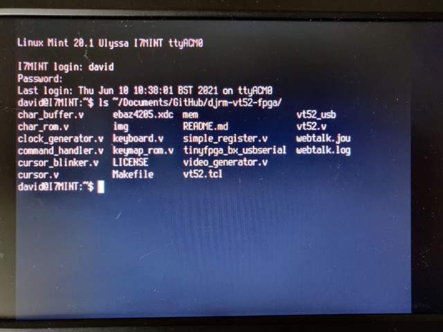
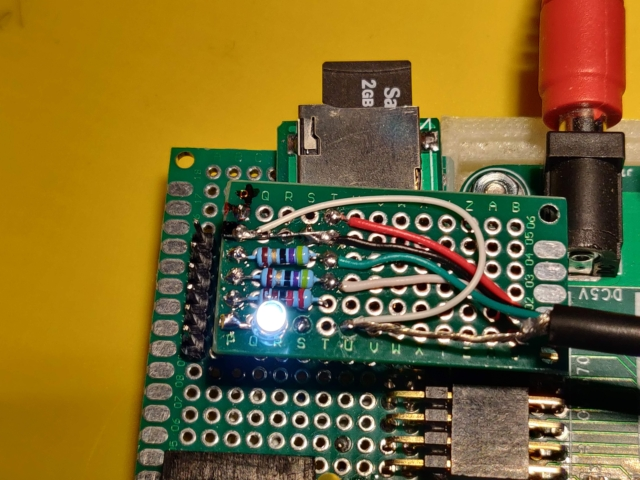

# USB UART

Projects using usb serial IP . this bit bashes a USB UART.

## usb-loopback

This is a demo project which simply echoes back to the output what it receives on the input.

## vt52-fpga

https://github.com/DavidJRichards/vt52-fpga

This version is a branch targeted to run on the ebaz4205 zynq board
original readme here [readme](./vt52-fpga.md)

The original project is hosted here: [vt52-fpga](https://github.com/AndresNavarro82/vt52-fpga)

The terminal appears as a USB device 'ttyACM0' when the PL runs, it may be used as a terminal or login session.

```
sudo systemctl enable serial-getty@ttyACM0.service
sudo systemctl start serial-getty@ttyACM0.service
```




Some minor changes were needed to make the sources build with Vivado, A custom pll has been used taking the external 33.333 MHz clock to derive the 24 MHz VGA clock and 48 MHz USB clock.

The vivado tcl script v52-usb.tcl will create a project 'vt52-usb' when sourced in this directory.

There is an LED which flashes at the same rate as the VGA cursor when the PL is active.

The keyboard is a PS/2 PC keyboard with clock and data lines fed into the fpga with current limiting resistors and pull ups to 5V.

The USB interface is very simple consisting of current limiting resistors of 47R and a pull up resistor to identify the USB transfer speed. A separate output is used to pull the D+ line high through 2k2 to identify full speed USB, an internal pull up on D+ may be used instead.


